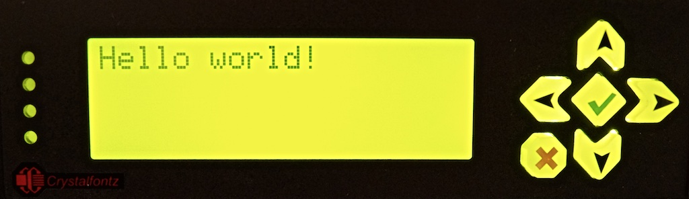

# lcdsh

This is a small bash 'library' for manipulating LCD displays driven by [LCDproc](http://lcdproc.sourceforge.net). Rather than implementing the wide range of widgets supported by LCDproc, lcdsh is focused on reducing the friction required to display basic text messages on the screen. Ideally, sending a message to the LCD should be as simple as piping some text. In fact, that's basically it:

```bash
lcd_init_prompt || exit 1         # Initializes LCDproc session
echo "Hello world!" | lcd_show    # Displays our message
lcd_msg_loop                      # Handles messages and waits for termination
```

Which gives us:


